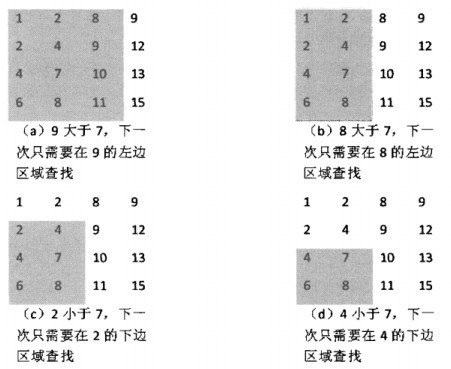

#链接
------- 

>牛客OJ：[二维数组中的查找](http://www.nowcoder.com/practice/abc3fe2ce8e146608e868a70efebf62e?tpId=13&tqId=11154&rp=1&ru=/ta/coding-interviews&qru=/ta/coding-interviews/question-ranking)
>
>九度OJ：[二维数组中的查找](http://ac.jobdu.com/problem.php?pid=1384)
>
>CSDN题解：[剑指Offer--003--二维数组中的查找](http://blog.csdn.net/gatieme/article/details/51100125)

<br>

你也可以[回到目录--剑指Offer--题集目录索引](http://blog.csdn.net/gatieme/article/details/51916802)


#题意
-------

**题目描述**

>在一个二维数组中，每一行都按照从左到右递增的顺序排序，每一列都按照从上到下递增的顺序排序。请完成一个函数，输入这样的一个二维数组和一个整数，判断数组中是否含有该整数。 

**输入描述**

>array： 待查找的二维数组
>target：查找的数字

**输出描述**
>查找到返回true，查找不到返回false


#暴力解法
-------


暴力的解法，肯定是用两层大循环来查找，不多说直接上代码
```py

```


#分治解法
-------

##思路
-------

从数组中选取数字，和目标数字的关系有三种情况：=，<或>。

1.    如果是等于则查找成功；

2.    如果是数组中元素小于要查找的数字，说明要查找的数字应该在当前位置的右边或下边。

3.    如果是数组中元素大于要查找的数字，说明要查找的数字应该在当前位置的左边或上边。


即
<font color=0x00ffff>
对于数组中的任何一个元素, 比它小的元素都在它的**左方或者上方**, 比它大的元素都在它的**右边或者下方** 
</font>

但是这两个区域还有可能有重叠，比如右边或下边会在右下角有重叠。


为了不重复的处理重叠的数据, 我们可以找几个特殊的起点, 比如

| 起点 | 性质 | 可否作为起点
|:-------:|:-------:|:-------:|
| 左上角 | 没有上方元素(小)和左方元素(小)<br>只有下方元素(大)和右方元素(大) | 否 |
| 右上角 | 没有上方元素(小), 和右方元素(大)<br>只有下方元素(大)和左方元素(小) | 是 |
| 左下角 | 没有下方元素(大), 和左方元素(小)<br>只有上方元素(小)和右方元素(大) | 是 |
| 右下角 | 没有下方元素(大), 和右方元素(大)<br>只有上方元素(小)和左方元素(小) | 否 |

因此重叠问题的解决方法：

*    如果查找从右上角开始，如果要查找的数字不在右上角，则每次可以剔除一列或一行。

*    也可以从左下角开始

*    但是不能从左上角或者右下角开始。

因为如果选择右上角的元素,


如图，即是我们在二维数组中查找7的轨迹





##从右上角的元素出发
-------

比如我们从右上角的数据开始出发

*    比他小的数必定在它的左侧，就往左找

*   比他大的数必定在它的下侧，就往下找 

```py
# -*- coding:utf-8 -*-
class Solution:
    # array 二维列表
    def Find(self, target, array):
        if array == [] or array == [[]]:
            return False
        depth, width = len(array), len(array[0])
        row, column = 0, width-1
        while column >= 0 and row <= depth-1:
            if array[row][column] == target:
                return True
            elif array[row][column] > target:
                column = column-1
            elif array[row][column] < target:
                row = row+1
        return False
```


##从左下角的元素出发(省略)
-------


比如我们从左下角的数据开始出发

*    比他小的数必定在它的上侧，就往上找

*   比他大的数必定在它的右侧，就往右找 


